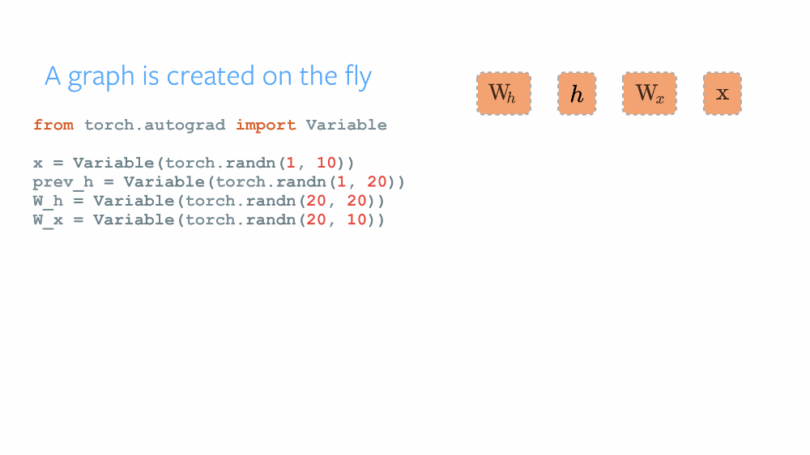

Pytorch自动求梯度原理介绍
===========================================

## 1

图3.1 含隐藏状态的循环神经网络

## 小结

* 使用循环计算的网络即循环神经网络。

-----------
> [原书传送门](https://zh.d2l.ai/chapter_recurrent-neural-networks/rnn.html)
